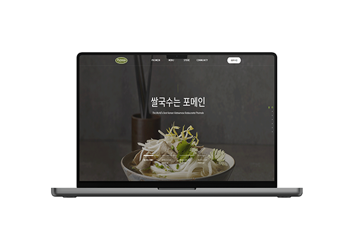

# 📌 Phomein 클론코딩

### 포메인

## 💻 Clone Coding 
** 쌀국수 브랜드 포메인의 클론코딩 웹사이트입니다. ** GD WEB(지디웹) 선정작이며 Fullpage.js 라이브러리를 사용하였습니다.   

 

### 👀 클론코딩 사이트 보기 (Click to View) 
👉 <https://breeghty.github.io/Phomein_clonecoding/>

 

### ✔ 작업일자(Date)
2022.10.

 

### ✔ 키워드(Keyword)
- 클론코딩 100%
- 웹표준, 웹접근성, 풀페이지
- HTML, CSS, Javascript, jQuery
- GD WEB(지디웹) 선정작, fullpage.js, slick.js

 

### ✔ 풀페이지(Full page)

